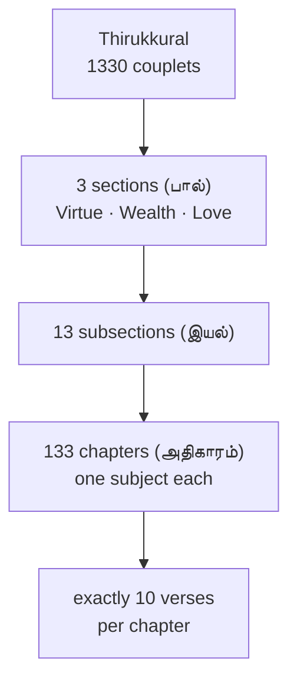
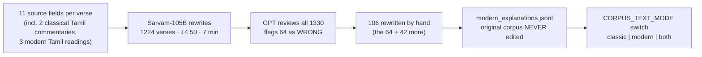
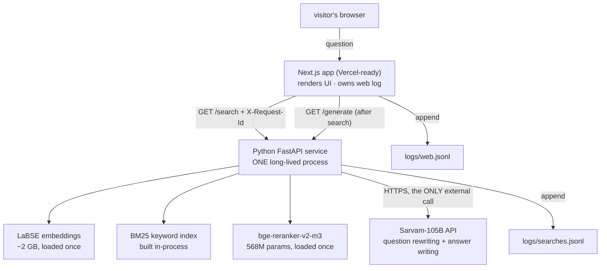
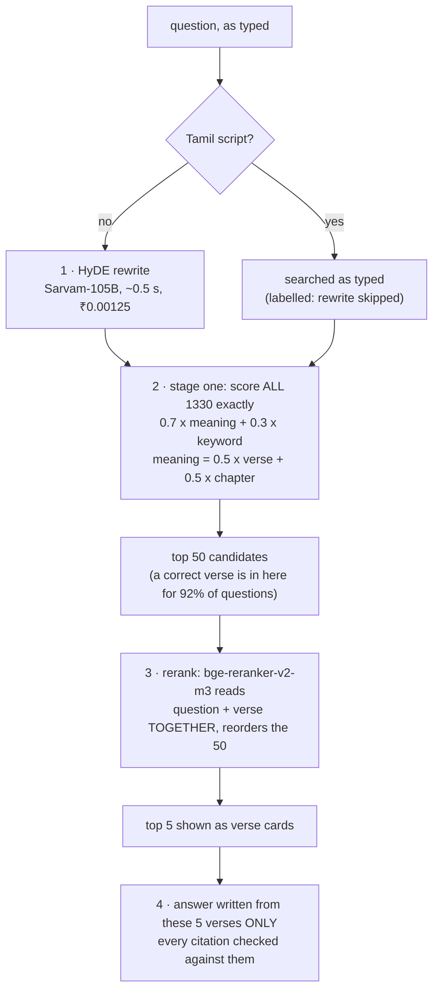

# KURAL RAG — THE PROJECT UNIVERSE

**The complete, authoritative reference for the Kural RAG project.**
Last updated: 2026-08-05 · Repository state: commit `429d03f` on branch `phase5-evaluation-harness`

---

## 0 · How to use this document

This file is the single source of truth about this project, written for two
readers: a person preparing public posts about it, and an AI assistant asked
to help with those posts.

**Rules for any AI assistant reading this:**

1. **This document supersedes** `RESUME_BRIEF.md`, `WEB.md`, and
   `WHERE_WE_LEFT_OFF.md`. All three are stale: they quote numbers from
   before the reranker replacement of 2026-08-04 (they say "44 → 90",
   "85/100", and "grounded answer — not built"; the current numbers and
   state are in §10 here).
2. **Every number in this document is a measured fact** from the repository —
   from `EXPERIMENT_LOG.md`, `LEARNING_LOG.md`, `LEARNING_GAPS.md`, or a
   named source-file docstring. Nothing is rounded up. Do not round,
   extrapolate, or "improve" any number when quoting.
3. **The claims inventory in §12 is binding.** Results marked
   NOT ESTABLISHED must never be presented as findings, in any post, in any
   wording. Results marked VOID must never be quoted at all except as
   examples of catching leakage.
4. **Always report rank-1 beside top-5** (see §6.3). Quoting only the
   higher number misrepresents what a user experiences.
5. The project's owner is Vikash (also "Vanji"). This is a solo learning
   project; do not describe it as a team effort or a product company.

---

## 1 · The product in one screen

**Kural RAG** answers life questions from the Thirukkural — a classical
Tamil text of 1330 two-line verses (each verse is a *kural*) on ethics,
governance, and love, written around 2,000 years ago.

A visitor types a question in **English, Tamil, or Thanglish** (Tamil words
written in Latin letters, e.g. *"sinam adakkuvadhu eppadi"*). The system:

1. retrieves the genuinely relevant verses from all 1330 — even when the
   question shares no words with the text, and even across languages;
2. shows each verse with its Tamil original, transliteration, English
   translations, three modern Tamil prose readings, and two classical
   commentaries;
3. writes a short answer **using only the retrieved verses**, where every
   claim carries the number of the verse it rests on — a citation the
   reader can click to jump to that verse. A citation the model invents
   (a verse number it was never given) is dropped and logged, never shown.

Honesty is a feature, not a tone. The interface displays which engine
produced every score, announces degraded modes by name, refuses to claim
confidence while its scores are uncalibrated (§5.7), and renders missing
measurements as blanks — *"what is still missing from this page is missing,
not estimated."*

**Current measured performance** (233-question benchmark, details §6–§7):

| what a user experiences | value |
|---|---|
| a correct verse appears in the 5 shown | 182 / 233 = **78%** |
| the *first* verse shown is correct | 131 / 233 = **56%** |
| latency, uncached, laptop CPU | ~16–25 s (reranker-bound; 875 ms on a T4 GPU) |
| cost per query | ~₹0.005 (≈ US $0.00006) |

---

## 2 · Origin: a classroom, not a delivery project

The repository's own constitution (`CLAUDE.md`) opens: *"This repository is
a classroom, not a delivery project. The working product is a side effect.
The actual deliverable is that I understand every line and every concept in
it."*

**The builder.** Vikash is a strong full-stack developer (React, Next.js,
Python, FastAPI, PostgreSQL, Docker) who started this project as a beginner
in machine learning, with the stated goal of becoming an ML/AI engineer in
12–18 months. His previous project, **LinkGuard** — a malicious-URL
classifier Chrome extension — taught him train/test splits, precision,
recall, F1, and what an evaluation harness is for. This project builds on
that foundation.

**The method.** Every concept is built by hand before any library is
allowed to hide it: cosine similarity computed on paper with toy vectors
before `numpy`; retrieval as a plain Python loop over all 1330 verses
before any optimization; BM25 keyword search derived from three plain-
language ideas before its formula was named. Two standing disciplines:

- **Predict-before-run.** Before any experiment, the expected outcome is
  written down. The gap between prediction and result is where the
  learning happens — and this document records several predictions that
  were wrong, on purpose.
- **Explain-back.** A concept doesn't count as learned until it can be
  explained back from scratch. The project's Phase 0 began by *revoking* a
  previously claimed understanding: cosine similarity had been "run" but
  could not be explained, so it was rebuilt from zero.

**The exact-only rule (§3.5 of CLAUDE.md).** Full accuracy outranks speed
everywhere. The clearest consequence: **FAISS** (a library for fast
*approximate* nearest-neighbour search) **was deleted from the project**,
along with the entire phase that would have introduced it. At 1330 verses,
an exact scan takes 4 ms; an approximate index would trade real accuracy
for speed nobody needs. Any optimization — quantization, caching, cutoffs —
must be *proven* to cost zero accuracy on the benchmark, or it does not
ship. "Nearly as good and much faster" is explicitly not a trade this
project makes.

**Timeline.** Seventeen commits, 2026-07-28 → 2026-08-04, one phase per
lesson:

```
2026-07-28  Phase 0   repo setup, pipeline map, cosine similarity from first principles
2026-07-29  Phase 1   clean 1330-kural corpus, text audit, embedding audit
2026-07-29  Phase 8*  frontend built early on the design system (*out of order, deliberately)
2026-07-30  Phase 1   close-out: measure the audit detector's limits
2026-08-01  Phase 5   golden set built; baseline measured at 44/100
2026-08-02  (6 commits) Phase 3 naive loop · Phase 5 scorecard 44→85 · wired into app ·
            FAISS removed · LEARNING_GAPS.md created · chapter descriptions · HyDE adopted
2026-08-03  hosted rewriter (Sarvam-105B) · full-stack wiring · corpus modernised
2026-08-04  reranker convicted by intervention and replaced (rank-1 105→131) ·
            Phase 7 wired: grounded answers with checked citations
```

---

## 3 · The corpus

### 3.1 The text

The Thirukkural is rigidly structured, and the corpus preserves that
structure exactly:



Chapter membership is arithmetic — verse *n* belongs to chapter
⌈n/10⌉ — and the code never keys off chapter *titles*, because two chapters
share the English title "Reading the Signs". **Chapter number is the
identity.**

### 3.2 Two raw sources, one hard-won join rule

The corpus was built (`src/build_corpus.py`) from two public raw files:

- `thirukkural.json` — all 1330 verses, well structured, English fields,
  **no Parimelazhagar commentary** (the canonical 13th-century Tamil
  commentary);
- `all_thirukkural_information.json` — has the commentary, but is
  **missing verses 395 and 648**.

The build rule, in capitals in the source: **JOIN ON THE KURAL NUMBER,
NEVER ON POSITION.** A positional join would silently mis-pair **934 of
1330** records, because everything after a hole slides up by one. This is
the project's archetypal bug shape: nothing crashes, the output looks fine,
and 70% of it is wrong.

### 3.3 Defects found, and hand-repairs with receipts

A written audit (`src/audit_corpus.py` — 11 checks that "only look, count,
and report") plus an embedding-based audit found, among others:

| defect | detail |
|---|---|
| verse 1000, line 1 truncated | read `ண்பிலான்` instead of `பண்பிலான்` — the only line disagreement in all 1330 |
| verse 524 carried verse 468's meaning | wrong in **both** raw sources and 2 of 3 reference websites — they copy the same upstream dataset. *"Agreement between sources proves nothing when they copy one another."* |
| verse 870 carried verse 810's meaning | |
| 664 records | Manakkudavar commentary had an English translation glued onto the end |
| verses 319–320 | two commentators' text run together |
| 25 records | the English "explanation" was actually a verbatim slice of the poetic couplet — found **only** by the embedding audit; invisible to all 11 text checks |

Every hand-repair records its verification count (e.g. verse 395's
Parimelazhagar commentary verified against 2 independent sources; its
Karunanidhi meaning against only 1 — *"flagged as such"*). Five of nine
hand-sourced values are single-sourced, and the data says so rather than
hiding it.

**The detector was tested before being trusted.** 22 errors were planted
(2 recreated historical ones + 20 random meaning-swaps, fixed seed):

| embedding model | planted errors caught |
|---|---|
| paraphrase-multilingual-MiniLM-L12-v2 (384 dimensions) | **0 / 22** |
| **LaBSE** (768 dimensions) | **15 / 22 (68%)** |

This measurement chose the project's embedding model (§5.3) and produced
the maxim: *"a detector nobody has tested is worth nothing."*

The final corpus: **1330 records × 17 required text fields** (location,
verse, transliteration, three English renderings, three modern Tamil prose
readings, two classical commentaries) plus provenance flags. A build gate
refuses to write the file if any check fails.

### 3.4 The modernisation project (2026-08-03)

**Hypothesis (Vikash's, verbatim):** *"the english meaning is also very
old, the current modern llms were not trained on this old english."* The
shipped English explanations are 1880s prose — *"(A) pleasing (object) to
his foes is he who reads not moral works…"* — while the embedding model was
trained on modern text. HyDE (§5.2) moves the *question* toward the book's
vocabulary; this moves the *book* toward the question's. Both ends moving
toward each other.



**The invention signature.** Every rejected rewrite had the same shape:
rejected ones averaged **1.86 sentences (80% had 2+)**; accepted ones
averaged **1.15 (15%)**. **Every invention lived in a second sentence** —
e.g. verse 17 gained *"This is like how a society thrives only when its
successful people contribute back to it"*, which appears in no source, and
would have been retrieved and then *cited with a verse number attached*.
The root cause was the project's own prompt ("write 1 to 2 sentences" +
"do not interpret" — a contradiction). Fix: one sentence, named forbidden
openers, and an automated `--check`. Maxim minted: **"a rule nothing
checks is a wish."**

**Important nuance for any post:** "modern corpus mode" replaced only the
*prose*. The compressed Victorian verse translation (`english_translation`)
was never rewritten and still feeds both search indexes. The corpus that
scored 97/100 on the honest set is *half modern* — and removing the old
poem was measured (run #9, §7.6) and did not survive the evidence bar.

---

## 4 · Architecture

### 4.1 The whole system



**Why two processes:** loading LaBSE takes seconds and about a gigabyte of
memory. A design that paid that per request "is not a product." One Python
process loads everything at startup and answers over HTTP for as long as it
lives. *"That single fact is the whole architecture."* This is also why the
backend needs an always-on server rather than serverless functions.

### 4.2 The logging join

Every request gets a 12-character id, minted in the web app and carried in
the `X-Request-Id` header. Both processes write it into their own log line,
so *"why did THAT search take four seconds"* has an answer — the web log
holds what the reader actually waited (`waitedMs`, network hop included);
the service log holds per-stage timings (rewrite / search / rerank), the
rewritten query, scores, and a `degraded` flag. The id is also returned to
the browser, so a user reporting a bad search can quote something that
*finds* the request rather than describes it.

### 4.3 Secrets by architecture, not discipline

The API key reaches exactly one process. The browser talks to Next.js,
Next.js talks to the Python service, and only the Python service holds a
key — *"a secret that never arrives cannot leak."* Inside that process:
the key is scrubbed from every error message, `__repr__` is overridden so
tracebacks can't print it, `/health` returns *"not the key, not a prefix of
it, not its length — a key is never a status,"* and `src/audit_wiring.py`
runs six loud checks including "the key is not in git, not in any file the
app serves."

---

## 5 · The pipeline, stage by stage

Every constant below is a measured decision. The measurement that chose it
is named beside it.



### 5.1 Why rewrite the question at all

The embedding model matches the *shape* of text, not just its subject.
Verse 251 — about eating meat — answered **26 of the first 100** test
questions, because its translation opens with a rhetorical question and so
did the queries. Separately, BM25 weighted the word "how" at **3.78**,
nearly equal to "anger" at **4.13**, because the corpus is old verse that
rarely says "how do I my".

The first fix was free: strip ~111 question/function words. That single
change took the golden set from **44 to 69 of 100** — the largest single
gain in the project. *"No information was added. Noise was removed."* But
the word list sometimes destroyed the question ("should I spend time with
people better than me?" → "spend time").

### 5.2 HyDE — rewrite the question as an answer

**HyDE** (Hypothetical Document Embeddings) rewrites the question into a
statement of what its answer would say, then searches with *that*. It was
Vikash's own idea before it was known to be a published technique: *"any
question would be transformed into answer... so that actual answer is
looked up not a rhetorical question."* The clearest case in the project:

```
Q          "I open my laptop and end up doing nothing for hours"
word list  open laptop end doing nothing hours          <- searches for LAPTOP
HyDE       using laptop, wasting time, idleness, procrastination, inactivity
```

The rewriter ladder, measured on 233 questions (top-5 hit):

| rewriter | score | speed / cost |
|---|---|---|
| word list (no model) | 144 / 233 | free |
| Qwen3-1.7B, local | 155 / 233 | 5.1 s per rewrite |
| **Sarvam-105B, hosted (ships)** | **170 / 233** | 0.5 s, ₹0.00125 |

Sarvam beats the word list at p = 0.0000 — settled. Against Qwen it scored
15 higher but **p = 0.0534, so it is NOT proven better and the code
refuses to claim it**; it ships on latency grounds (a local model needs
~100 s per question on a real host). The rewrite prompt teaches with
examples about cars, code and plumbing — subjects the corpus never touches
— because a smaller model once reproduced an in-domain example verbatim
and scored for "bridging vocabulary" while having bridged nothing.

Every rewrite is cached (temperature 0 ⇒ same question, same rewrite,
forever), keyed by a hash of question + model + full instruction text, so
changing the prompt can never silently serve stale rewrites. A circuit
breaker (3 failures → 60 s pause) means a provider outage degrades to
searching the question as typed — *and says so in the result*.

### 5.3 Embeddings — the meaning half of stage one

An **embedding** turns text into a fixed list of numbers such that similar
meanings land near each other; similarity is measured by **cosine
similarity** (the angle between the two number-lists — 1.0 identical
direction, 0 unrelated). This is what lets an English question match a
Tamil verse: the model, **LaBSE** (768 numbers per text), was trained so a
sentence and its translation land in nearly the same place.

LaBSE was chosen by the planted-error test (§3.3): it caught 15/22 planted
corpus errors where the smaller multilingual MiniLM caught 0/22. All 1330
verse vectors are precomputed and cached with a fingerprint of the model
name and every input text — a cache that can't silently serve vectors of a
corpus that no longer exists.

What text each verse is searched by was itself measured (precision@5 on
chapter-name probes): translation+explanation+Tamil meaning **0.241** ·
translation alone 0.205 · explanation alone 0.171 · the Tamil verse itself
0.091 · the transliteration 0.012. Compressed classical Tamil is one of
the *worst* things to search; the Tamil prose meaning helps even for
English questions, because the model is multilingual.

### 5.4 BM25 — the keyword half of stage one

**BM25** is classical keyword search, built here by hand from three plain
ideas before its formula was named: (1) rare words count more — a word in
12 verses nearly points at the answer by itself, a word in 500 tells them
apart not at all; (2) matching more distinct query words beats matching
one repeatedly; (3) short texts win ties. Constants are the original
paper's (saturation 1.5, length penalty 0.75), deliberately untuned.

Why keep keywords alongside embeddings: their failure modes differ.
Embeddings find "restrain wrath" from "controlling anger" but also
confidently return the meat verse; keyword search will never make either
mistake, and never the same mistake. Measured: BM25 was worth **zero**
before the rewrite (52 → 52) and **six points** after it (69 → 75) — two
methods that fail identically cannot cover for each other; the rewrite is
what made them fail differently.

### 5.5 The blend — every weight measured

Stage one's final score = `0.3 × keyword + 0.7 × meaning`, where meaning =
`0.5 × verse-similarity + 0.5 × chapter-similarity`. The chapter signal
compares the question against 133 hand-written chapter descriptions (a 2–3
sentence topic summary plus a modern-vocabulary bridge — the corpus says
*sloth*, a reader says *lazy*, and the description is where "lazy" gets
written in). Scores are rescaled per question before blending, because
cosine runs ~0.0–0.5 and BM25 runs ~0–20 — added raw, BM25 would drown the
embeddings entirely.

The measurements: keyword weight 0.3 (75) beat 0.5 (67) and 0.7 (49).
Chapter blend 0.5 (52) beat 0.8 (**42 — worse than the 44 baseline**; the
earlier test that said 0.8 was "best" had defined correct as "in the right
chapter" — §9.2). Chapter-only scored 33.

### 5.6 The reranker — stage two

Stage one compares *frozen* summaries: each verse's vector was computed
before any question existed. A **cross-encoder** reranker removes that
limit by reading question + verse *together*, one pair at a time, and
scoring "does this verse answer this question". It's far too slow to run
on all 1330, so it reads only stage one's top **50** — a number chosen
from the measured ceiling curve (a reranker can only reorder what it's
given): top-5 ceiling 75, top-10 85, top-20 88, **top-50 94**, top-100 99,
top-200 99. Fifty is the knee.

The shipping reranker is **BAAI/bge-reranker-v2-m3** (568M parameters,
multilingual), which replaced the original 22M-parameter English web-search
model on 2026-08-04 after the intervention experiments of §7.7–§7.9:
rank-1 went **105 → 131 of 233 (p = 0.0001)**. The full story — including
the same model being *rejected* in July under a different configuration —
is in §7.

### 5.7 Confidence and refusal — measured, and therefore absent

The interface specifies a refusal policy (answer / show doubt / refuse),
but every threshold currently reads *"planned"*, because the measurement
(`src/calibrate.py`, 20 on-topic + 15 off-topic questions) says the score
cannot yet tell "the book answers this" from "it does not". The failure
*reversed direction* across engines: the old word-overlap engine scored
"who won the football world cup" at **0.847**, above almost every real
question; the current engine scores 14 of 15 off-topic questions at
exactly **0.000** — but so does at least one genuine question ("how do I
finish what I start"), so *"a floor set anywhere above 0.003 would refuse
four genuine questions to catch one fake — a worse trade than refusing
nothing."* Until the separation is clean, `calibrated: false` travels to
the browser and the interface refuses to claim confidence on the engine's
behalf.

### 5.8 Generation — Phase 7 (§8)

The final stage writes a 3–5 sentence answer from the five retrieved
verses **and nothing else**, with a checked citation on every claim.
Wired into the product on 2026-08-04. Details, and what remains unproven,
in §8.

---

## 6 · The evaluation harness — the project's differentiator

*"This is what turns 'I built a RAG' into 'I improved retrieval from X to
Y by changing Z.'"* — CLAUDE.md, Phase 5.

### 6.1 The two question sets

```
SET A  data/golden_set.json - 100 questions, THE HONEST SET
       answer key per question:
         - the question's own chapter(s)      (118 chapter refs across 100)
         - PLUS hand-checked verses from OTHER chapters that also answer it
           (200 across the set; each proposed by keyword sweep, then read
            and judged by a human)
       cannot be gamed by chapter-level matching

SET B  data/benchmark_questions_a.json - 133 questions, one per chapter
       (NAMING TRAP: the file says "_a" but this is Set B)
       answer key = that ONE chapter only
       deliberately awkward real-world phrasings ("my classmate got the
       promotion and I feel bitter")
       STRICTER in absolute terms (a correct verse from a neighbouring
       chapter counts wrong) and BIASED toward chapter-matching methods -
       any method that leans on chapters is rewarded by construction
```

Why the 200 extra answers matter — the worked example: verse 35 ("Four
ills eschew: lust, anger, envy, evil-speech") genuinely answers the anger
question but lives in chapter 4, not the anger chapter 31. Without the
hand-checked extras, the scorecard would punish a retriever for being
right.

### 6.2 Metrics, defined

- **top-5 hit** ("recall@5"): at least one correct verse in the five shown.
- **rank-1**: the *first* verse shown is correct — what a reader actually
  experiences.
- **reachable**: a correct verse made it into the 50 candidates at all —
  the reranker's ceiling.
- **precision@5**: of the five shown, how many are correct (measured 2.26
  of 5 = 0.45 at the 85/100 stage).
- **MRR** (mean reciprocal rank): 1.0 if the first result is always
  correct, 0.5 for second, etc. Measured 0.71 at 85/100, 0.778 at 90/100.

### 6.3 The funnel — the two numbers that must travel together

```
all 1330 verses
      |
      v   stage one (embeddings + keywords + chapters)
   50 candidates      correct verse present:  214/233   92%
      |
      v   reranker keeps 5
    5 shown           correct verse present:  182/233   78%
      |
      v   reranker orders them
    #1 result         correct:                131/233   56%
```

For most of the project only the top-5 number was quoted. The log's own
instruction, adopted as policy: **all future reporting gives both.** In
~22% of questions the right verse is in the five but not first — that gap
is reranker quality, and closing part of it (45% → 56%) was the single
strongest result of the project (§7.9).

### 6.4 McNemar's test — how "real or luck" is decided

Comparing two methods on the same questions, only the *disagreements*
carry information. If the methods were equally good, each disagreement is
a fair coin flip. The **p value** is the chance a fair coin produces a
split as lopsided as the one observed — computed exactly, and once by
hand in this project: a 9-vs-1 split in 10 disagreements has
1+10+10+1 = 22 lopsided outcomes of 2^10 = 1024, so **p = 22/1024 =
0.0215** — reproducing to four decimals the number the harness had
printed that morning. Below 0.05 (luck would do this less than 1 time in
20 — a convention, not a law) the project says REAL; otherwise
NOT ESTABLISHED, and the change does not ship.

Why the naive test would have lied — the same comparisons, both ways:

```
unpaired (wrong):  44 vs 52  z=1.13 "not significant"   McNemar: p=0.039  REAL
                   75 vs 85  z=1.77 "not significant"   McNemar: p=0.006  REAL
```

And the trap on the other side: with enough questions a *tiny* effect gets
a great p value; p says "probably not luck", never "big enough to matter".

### 6.5 The ceiling problem

Set A's best measured score is **97 of 100**. Three questions of room
remain, so on that set a real improvement and no improvement now produce
the same verdict ("not established"). *"The limit is now the test set, not
the pipeline. The ruler, not the model, is what needs to grow."* This is
why late experiments lean on the 233-question combined set and on rank-1,
where room remains.

---

## 7 · The experiment record

Every experiment, dated, with its exact numbers. Scores are top-5 hits
unless marked otherwise.

### 7.1 Phase 5 — one change at a time (2026-08-01 → 02, golden 100)

| method | hits/100 | median rank of first correct |
|---|---|---|
| plain embedding search (baseline) | 44 | 7 |
| chapter signal only | 33 | 21 |
| blend chapter 0.5 | 52 | 4 |
| keyword (BM25) only | 45 | 7 |
| hybrid, keyword 0.3 | 52 | 5 |
| **+ question rewrite** (word list) | **69** | 2 |
| rewrite + hybrid 0.3 | **75** | 1 |
| + cross-encoder rerank of top 50 | **85** | 1 |
| + hand-written chapter descriptions | **90** | 1 |

Progression, all McNemar-verified: 44→52 p=0.039 · 52→75 p=0.000 ·
75→85 p=0.006 · 44→85 p=0.000. The 85→90 step needed the question set
grown from 100 to 233 to establish (p=0.125 at n=100 → **p=0.0129** at
n=233): the first properly powered experiment, run after a power
calculation said ~200 questions would settle it.

```
golden set (100):   44 --> 52 --> 69 --> 75 --> 85 --> 90 --> 93(HyDE) --> 97 (modern corpus)
233-question set:  144 -----------> 163(HyDE) --> 170(Sarvam) --> 174(modern) --> 182(bge)
rank-1 (233):                                                    105 ---------> 131(bge)
```

### 7.2 HyDE (2026-08-02) — +19, p = 0.0034

Prediction written before the run: HyDE would help Set B far more than Set
A, because B carries awkward phrasings a word list can't handle. It held:
Set A +3 (90→93), Set B **+16** (54→70), together 144→163, **p = 0.0034**.
Standing caveat: part of the +16 may be HyDE steering harder toward single
chapters, which Set B rewards by construction — the honest headline is the
combined +19, not the +16.

### 7.3 The rewriter goes hosted (2026-08-03)

144 (word list) → 155 (Qwen local) → **170 (Sarvam-105B)**. The
project's own stop-rule was honoured in the write-up: Sarvam > word list
settled (p = 0.0000); Sarvam > Qwen **NOT claimed** (p = 0.0534); ships on
speed (0.5 s vs ~100 s/question on a real host), *"a different argument,
made honestly rather than smuggled in behind a number."* Also found:
Sarvam's default reasoning mode burned 400 output tokens returning an
*empty* answer — 26× the tokens for nothing; only disabling it entirely
worked (0.2 s, 13 tokens, correct).

### 7.4 The July reranker verdict (kept for contrast)

On the classic corpus, golden 100, top-5 only: bge-reranker scored 91 vs
the small model's 85, at **24× the latency** (11,840 ms vs 498 ms), and
adding Tamil input gained exactly zero. **REJECTED.** This verdict was
correct — and so was its reversal five weeks later (§7.9), because *"a
verdict is about a configuration, not a model."* Both verdicts are kept
side by side in `src/evaluate.py`.

### 7.5 Corpus modernisation measured (2026-08-03, runs #1–#6)

- Run #1 was **invalid**: the reranker read the 1880s English directly and
  ignored the corpus switch — the step that decides what a reader sees was
  Victorian in all three arms. (*"A measurement that only reaches half the
  pipeline is not a measurement of the pipeline."*)
- Run #2, fixed, six arms: modern corpus + classic prompt won at 174/233;
  the arm predicted to win (modern + modern prompt) lost at 164. All p
  failed on the 233 total.
- Run #5 split by set: **Set A 90 → 97, p = 0.0391, REAL** — a real effect
  had been hiding inside a biased average (Set A said +7, Set B said −3,
  the total said "nothing"). Caveat kept on record: a subgroup examined
  after the pre-registered test failed; what makes it more than fishing is
  the mechanism predicted in advance plus run #6.
- Run #6: all 8 newly-fixed questions failed the old way for the same
  reason — everyday word vs formal word (leader/king, money/wealth,
  scared/dread, gossip/scandal) — and were fixed by finding the right
  chapter.

### 7.6 The old poem, and a user-requested detour (runs #9–#10, 2026-08-04)

Four arms varying whether the Victorian couplet stays in the embeddings
and/or keyword index: best 174, worst 171, every p failed — **the poem
stays**. A requested configuration (modern prompt + poem out of
embeddings) was then measured rather than argued about: it lost REAL on
Set A (97→89, p = 0.0215) and was rolled back the same day. Diagnosis: the
classic prompt asks for old-fashioned words *alongside* everyday ones —
both vocabularies; the modern prompt carries only half.

### 7.7 Convicting the reranker (runs #11–#12)

Run #9's by-product was the funnel (§6.3): stage one reaches 92%; the
reranker loses 40 questions from the top 5 and mis-orders most of the
rest. Two experiments turned suspicion into conviction:

- **Correlation** (run #11): counting "tickets" — correct verses inside
  the 50 — success climbs with ticket count (0%, 45%, 59%, 76%, 85%, 92%)
  and never flattens. Flagged in advance as correlation only: easy
  questions may be easy for both stages.
- **Intervention** (run #12): widen the pile to 75. Tickets went UP
  (7.2 → 8.2 average) and the score went DOWN (174 → 165, **p = 0.0352
  REAL**). More candidates are distractors this reranker falls for. The
  correlation reading was dead; the reranker was the wall. The pile stays
  at 50.

### 7.8 The small-model bake-off (run #13) — one axis per arm

| arm | isolates | top-5 | rank-1 | ms |
|---|---|---|---|---|
| A · ms-marco-MiniLM-L-6 (shipped) | — | 174 | 105 | 623 |
| B · same family, 12 layers | depth | 177 | 107 | 1267 |
| C · 12-layer multilingual | language training | 168 | 95 | 1460 |
| D · C + Tamil input | input text | 176 | 104 | 2288 |

Every p failed; read as directions: depth +3 (noise), same-size
multilingualism −9, Tamil input +8 for a model that can read it.
Conclusion: the small family is exhausted; the candidate must be **large
and Tamil-capable**.

### 7.9 The replacement (run #14) — the strongest result in the project

bge-reranker-v2-m3 (568M — 25× the shipped model), run on a free Colab
T4 GPU via a portable package whose 50-candidate piles were **frozen at
home and shipped as data** (different machines' embeddings differ in the
last decimals — enough to swap candidate 50 for 51 and void the
comparison). The package was validated first: running the *shipping* model
through it reproduced the saved baseline with **zero** disagreements,
resumed from checkpoints, and survived `kill -9`.

| arm | Set A | Set B | top-5 | rank-1 | ms (T4) |
|---|---|---|---|---|---|
| A · small model (shipped) | 97/100 | 77/133 | 174/233 | 105/233 | 623 |
| E · bge, English text | 97/100 | 85/133 | 182/233 | **131/233** | 875 |
| F · bge + Tamil text | 97/100 | 90/133 | **187/233** | 124/233 | 1321 |

```
E vs A, rank-1:  won 35, lost 9,  p = 0.0001  REAL   <- the headline
F vs A, top-5:   won 19, lost 6,  p = 0.0146  REAL
E vs F:          not established either way
```

E ships: its rank-1 gain sits on the honest set (Set A rank-1 **68 → 80**),
while F's top-5 gain sits mostly on chapter-biased Set B — so the
Tamil-input question is deliberately deferred until the test set grows.
The pre-registered shipping rule ("a clear rank-1 gain at no top-5 cost")
was written before the run and passed emphatically. Cost accepted
knowingly: ~16–25 s per uncached question on a laptop CPU (875 ms on a
T4); quantization is queued to buy the speed back and must prove **zero**
accuracy loss first.

---

## 8 · Phase 7 — generation with citations

### 8.1 The one rule

*"The model may use the five verses it is given and NOTHING ELSE. Not its
own opinion about Thirukkural, not something it read during training, not
a plausible-sounding interpretation. If the verses do not answer the
question, the correct output is to say so."*

That rule is easy to write into a prompt and easy for a model to break —
so the code does not trust the prompt. Every citation the model writes
(`[301]`) is checked against the verse numbers it was actually given.
A number it invents is **dropped from the display** (a citation that leads
nowhere is *"a lie the reader can click"*) and **written to the log** so
its frequency can be measured. Costs ~₹0.004 per answer; answers are
cached; a null answer is a normal state ("the verses stand alone"), never
an error — *"an answer is an addition, never a requirement."* Refusal
propagates end to end: below the retrieval floor there are no verses and
no prose about them.

### 8.2 The judge that could not be trusted

A citation can be *numerically valid and semantically invented*: "Anger
destroys friendship [301]" passes the number check while verse 301 says
nothing about friendship. Measuring that needs a judge — and *"an
unchecked instrument is not a measurement, it is a second opinion."*
Three judges were compared on 113 claims:

| judge | SUPPORTED | PARTIAL | UNSUPPORTED | "clean" rate |
|---|---|---|---|---|
| Sarvam judging its own answers | 104 | 2 | 7 | 92.0% |
| GPT (different vendor, same instructions) | 83 | 27 | 3 | 73.5% |
| Human worksheet | 15 labelled, all SUPPORTED | | | (98 blank) |

Sarvam and GPT disagree on **30 of 113** claims; Sarvam even called a
word-for-word quote "unsupported". Conclusion on the record: **a model
cannot judge its own answers**, and citation validity remains *unmeasured*
— displayed as a blank in the app, not an estimate. Finishing the human
worksheet (or adjudicating the 30 disagreements) is open work.

### 8.3 What is wired, what is not

Wired and verified end-to-end (2026-08-04): service `/generate` endpoint,
web route, answer panel with clickable checked citations, caching,
degraded modes. **Not yet done: the breaking tests** — deliberately
feeding wrong verses, off-topic questions, and hunting invented citations
at scale. Until they run, the honest description is *"generation is wired
and citation-checked, but not yet adversarially tested."*

---

## 9 · Mistakes worth keeping

The project logs its failures with the same rigour as its wins — each one
minted a rule that now runs as code.

### 9.1 Three leakage incidents

1. **Chapter-name questions scored 0.992** — the question string literally
   was the corpus string.
2. **A frontier LLM's rewrites scored 97/100** — it had the chapter list
   in context and echoed correct chapter titles. Also rejected for a
   second reason: a measurement of a model you would never deploy is not a
   measurement. Rows kept in the log marked VOID.
3. **121 of 798 generated questions were verbatim golden-set copies** —
   *after* a plan had promised to keep the golden file closed. It was
   closed; the questions were already in conversational context.
   **Rule: "A plan to not-look is not a control. An automatic check is."**
   The check now runs (`src/check_prompt_leakage.py`) and exits non-zero
   on a hit.

### 9.2 The biased metric — twice, the second time one day after reading
the written warning

Defining "correct" as "in the right chapter" and then tuning the chapter
weight is a metric grading its own homework. It said 0.8 was best; the
honest set said 0.8 scored **42, below the 44 baseline**. Five weeks
later the same trap fired again (blend 0.7: +13 on the chapter-biased set,
+2 on the honest one) — with the July warning sitting in the code, read
that same morning. **Rule: a metric that rewards the thing being tested is
not a metric — and reading a lesson is not owning it.**

### 9.3 Averages over disagreeing halves

The modern corpus's 233-question total said "no effect" while Set A said
+7 and Set B said −3. The only real effect (p = 0.0391) was hiding inside
the average. **Rule: split every result by question set before believing
it.**

### 9.4 Mode switches that reach half the pipeline

Twice, a corpus-text switch changed stage one while the reranker (and once
a fallback path) kept reading the old text directly — producing a
measurement of a mismatch, not of the hypothesis. **Rule: audit the wiring
before trusting the number** (`src/audit_wiring.py` exists because of
this).

### 9.5 The 30-second rate-limit test

16 parallel calls looked 3.2× faster on 24 verses; run on 1,225 it
produced **783 rate-limit errors**, because a rate limit is counted per
minute and the test lasted 30 seconds. **Rule: a short test cannot see a
limit measured over a longer window than the test.**

### 9.6 Save-at-the-end — twice

A crashed rewrite run lost 100 paid rewrites (July); the fix went into one
script instead of the shared client, and the next long run died the same
way. Then in August a 2-hour reranker run was stopped for an overheating
laptop at question ~120 and lost everything, because it saved only at the
end — the same mistake in a new shape. **Rules: put the retry in the
shared component, checkpoint by expected runtime not habit** — and the new
checkpointing was proven with `kill -9`, not assumed.

### 9.7 Correlation vs intervention

Ticket counts correlated beautifully with success (§7.7) and the causal
story felt obvious. The intervention proved the opposite sign. **Rule: a
correlation plus a plausible mechanism is still not a cause; only an
intervention separates "easy is easy everywhere" from "X causes Y."**

### 9.8 Silent failures — the only kind this project has had

The running theme: *"Every bug we have hit in this project was silent.
None of them crashed."* A wrapper returning 0.000 for every pair with no
warning; a hosted model's reasoning mode returning empty answers while
billing 400 tokens; stranded counters silently skipping the rewrite. **The
maxim: "the bug that crashes is cheap; the bug that returns a plausible
number is expensive"** — answered project-wide by counting things on
purpose, loud checks, and refusing to return empty results.

---

## 10 · Current configuration and scorecard

The live pipeline, every switch, with the measurement that set it
(state as of commit `429d03f`, 2026-08-04):

| component | value | evidence |
|---|---|---|
| embedding model | LaBSE (768-dim) | planted-error test 15/22 vs 0/22 (§3.3) |
| corpus text searched | modern prose + old poem + Tamil meaning (`CORPUS_TEXT_MODE="modern"`) | run #5: Set A 90→97, p=0.0391 |
| query rewriter | Sarvam-105B, classic prompt (`PROMPT_MODE="classic"`) | run #10: modern prompt REAL loss p=0.0215 |
| chapter blend | 0.5 | 0.8 measured worse than nothing (§9.2) |
| keyword / meaning weights | 0.3 / 0.7 | 75 vs 67 vs 49 |
| chapter descriptions | topic + modern words | p=0.0129 vs glued baseline |
| candidate pile | 50 | run #12: 75 is a REAL loss p=0.0352; ceiling curve knee |
| reranker | **bge-reranker-v2-m3**, English text (`PRODUCTION_RERANKER_MODEL`) | run #14: rank-1 105→131 p=0.0001 |
| generation | Sarvam-105B, 5 verses only, citations checked | wired 2026-08-04; unbroken-tested |
| confidence thresholds | none (`calibrated: false`) | §5.7 — the measurement said no |

**Scorecard:** top-5 **182/233 (78%)** · rank-1 **131/233 (56%)** ·
Set A top-5 **97/100** (ceiling: 3 questions of room) · reachable
**214/233 (92%)** · rank-1 on the honest set **80/100**.

**Runtime:** ~16–25 s per uncached search on the development laptop
(reranker-bound; 875 ms on a rented T4 GPU) · repeat questions served from
cache · ~₹0.005 per query (rewrite ₹0.00125 + answer ₹0.004) · memory
~5 GB with all models loaded.

---

## 11 · Status and roadmap

**Done and measured:** corpus (built, audited, modernised) · exact
retrieval with hybrid scoring · HyDE rewriting, hosted · reranking, model
chosen by controlled bake-off · evaluation harness with 233 questions and
paired significance testing · full web app with honest states · grounded
generation with checked citations, wired locally · structured two-sided
logging.

**Open, in rough priority order:**

1. **Phase 7 breaking tests** — attack the generator before the public
   sees it (wrong verses, off-topic questions, invented-citation hunting).
2. **Quantization of bge** — shrink the reranker for CPU serving; ships
   only if it answers all 233 questions identically (exact-only rule).
3. **Hosting** — target ≤ ₹700/month: Oracle Always Free first (fits the
   small model today; bge pending quantization), Vercel for the frontend,
   Sarvam key with a spending cap and per-IP rate limiting.
4. **Citation-validity measurement** — finish the human worksheet /
   adjudicate the 30 judge disagreements (§8.2).
5. **Grow the test set** — Set A is at its ceiling (97/100); *"the ruler,
   not the model, needs to grow."* Also unlocks the deferred E-vs-F
   (Tamil reranker input) decision.
6. **Calibration** — a refusal floor, when a measurement earns it.
7. **The unmeasured promises** — Thanglish queries (pre-work similarity
   ~0.24, never addressed), Tamil-language questions (skip the rewriter,
   unmeasured), Parimelazhagar commentary as a retrieval field (never fed
   to anything), the 15 remaining Set-A misses (never read; one is
   unreachable at any cutoff, which usually means the answer key entry
   itself is wrong).

---

## 12 · Claims inventory — binding for all posts

### 12.1 ESTABLISHED — safe to claim, with the stated caveat

| claim | evidence | required caveat |
|---|---|---|
| Retrieval improved from 44/100 to 97/100 on a hand-built golden set | McNemar-verified chain §7.1 | measured, one change at a time |
| The largest single gain (44→69) came from *deleting* question words | §5.1 | "noise was removed, not information added" |
| HyDE rewriting: +19 on 233 questions, p = 0.0034 | §7.2 | quote the combined +19, not Set B's +16 alone |
| Hand-written chapter descriptions: +10 on 233, p = 0.0129 | §7.1 | established only after growing the set to 233 |
| Modernising the corpus: Set A 90→97, p = 0.0391 | §7.5 | subgroup result; strengthened by a pre-stated mechanism and 8 uniform case studies |
| Replacing the reranker: rank-1 105→131 (45%→56%), p = 0.0001 | §7.9 | strongest result in the project; laptop latency cost stated |
| Widening the candidate pile made results WORSE (p = 0.0352) | §7.7 | the intervention that convicted the reranker |
| A modern-prompt + poem-removal configuration lost REAL (p = 0.0215) and was rolled back same day | §7.6 | negative results are reported, not hidden |
| Rank-1 is 56%; top-5 is 78% | §6.3 | **always quote both together** |

### 12.2 NOT ESTABLISHED — must never be claimed as findings

| non-claim | the number that forbids it |
|---|---|
| "Sarvam is better than the local Qwen rewriter" | p = 0.0534 — ships on speed, openly |
| "Tamil input makes the reranker better" (E vs F) | not established either way; deferred |
| "Removing the Victorian poem helps" | every arm's p failed (run #9) |
| "The in-domain prompt beats the out-of-domain one" | 169 vs 164, p failed |
| "12 layers beat 6" / any run-#13 direction | every p failed; directions only |

### 12.3 VOID — never quote as results

The LLM-rewrite rows (97/94/89 of 100): leaked (chapter list in context)
AND non-transferable (a model nobody would deploy). Kept in the log only
as an example of catching leakage.

### 12.4 Quotable maxims (all genuinely from this project's log)

- "A plan to not-look is not a control. An automatic check is."
- "A rule nothing checks is a wish."
- "A metric that rewards the thing you are testing is not a metric."
- "The bug that crashes is cheap; the bug that returns a plausible number
  is expensive."
- "A verdict is about a configuration, not a model."
- "The ruler, not the model, is what needs to grow."
- "A wrapper that fails loudly is a bug. One that fails silently is a trap."
- "Retrieval is the ceiling: a perfect model fed the wrong verses produces
  a confidently wrong answer."
- "The thing we measure must be the exact thing we serve."
- "An unchecked instrument is not a measurement, it is a second opinion."
- "No information was added. Noise was removed." (on 44→69)
- "Refusal means refusal all the way down."

---

## 13 · Glossary

- **kural** — one two-line verse of the Thirukkural; 1330 in total.
- **RAG** (retrieval-augmented generation) — retrieve relevant documents
  first, then have a language model answer *from them* rather than from
  memory.
- **embedding** — text turned into a fixed list of numbers so that similar
  meanings sit close together.
- **cosine similarity** — the closeness of two embeddings, by the angle
  between them; 1.0 = same direction, ~0 = unrelated.
- **LaBSE** — the multilingual embedding model used here (768 numbers per
  text); trained so translations land near each other.
- **BM25** — classical keyword scoring: rare shared words count most,
  short texts win ties.
- **HyDE** — rewriting a question into a statement of what its answer
  would say, and searching with that.
- **cross-encoder / reranker** — a model that reads question and candidate
  *together* and scores the pair; too slow for a whole corpus, used on a
  short candidate list.
- **bge-reranker-v2-m3** — the 568M-parameter multilingual cross-encoder
  now in production.
- **top-5 hit / recall@5** — a correct verse appears in the five shown.
- **rank-1** — the first verse shown is correct.
- **reachable** — a correct verse made it into the reranker's 50
  candidates at all.
- **precision@5 / MRR** — how many of the five are correct / how high the
  first correct one ranks (1.0 = always first).
- **McNemar's exact test** — paired significance test over only the
  questions two methods disagree on.
- **p value** — the probability that pure luck would produce a gap this
  lopsided; below 0.05 this project says REAL.
- **golden set** — the 100 hand-checked question→verse pairs (Set A).
- **leakage** — when the answer sneaks into the input, inflating a score
  for the wrong reason.
- **calibration** — whether a score's absolute value means anything across
  questions (here: measured, and currently no).
- **quantization** — storing model numbers in fewer bits to run faster;
  allowed here only at proven-zero accuracy cost.
- **FAISS** — an approximate nearest-neighbour library; deleted from this
  project by the exact-only rule.
- **Thanglish** — Tamil written in Latin letters.
- **Parimelazhagar / Manakkudavar** — the classical Tamil commentators
  (13th c. / c. 11th c.) whose texts the corpus carries.
- **Sarvam-105B** — the hosted Indian-language LLM used for rewriting and
  answer generation.

---

*End of the universe. If a fact about this project is not in this file or
in the repository's logs, treat it as unverified.*
